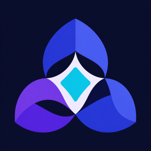

  

<h1 align="center">Projects Emergence</h1>

<strong>Build projects the way research builds knowledge.</strong>

An Agent Skill that applies academic research methods to project and product development.

<a href="README.zh-CN.md">简体中文</a>

## The core idea

Projects Emergence does not treat a project as a list of tasks to complete. It treats a project as a sequence of decisions that should remain inspectable, testable, and revisable.

Academic research has developed practical ways to work under uncertainty: formulate a question, examine prior work, reproduce important results, propose a falsifiable hypothesis, design an experiment, evaluate evidence, expose limitations, and revise the conclusion. Projects Emergence translates that logic into project and product work.

It does **not** turn every project into a paper or every task into a research exercise. It borrows the mechanisms that make knowledge trustworthy and applies them in proportion to the decision at hand.

## From research method to product method

| Academic research | Project and product development |
|---|---|
| Research question | User problem and project objective |
| Literature review | Existing products, papers, repositories, and cases |
| Replication | Reproduce the reference mechanism or observable behavior |
| Hypothesis | Product or improvement hypothesis |
| Experiment design | Smallest informative implementation |
| Results | Tests, logs, comparisons, and user evidence |
| Discussion and limitations | Reflection, critique, and unsupported claims |
| Revision | Re-enter research and change the project |
| Publication | Reproducible, reviewable public handoff |

A rough idea becomes a project only when its reasoning can be followed:

~~~text
question
  → prior work
  → reproduction
  → hypothesis
  → minimum experiment
  → evidence
  → reflection
  → revision or publication
~~~

In agent work, that becomes a practical decision loop:

~~~text
clarify → research → replicate or adapt → implement
        → reflect → research → revise
~~~

## The underlying principles

### Research serves a decision

Research is not a ceremonial phase at the beginning. Each research pass must answer:

1. Why is research needed now?
2. What evidence would be sufficient?
3. Which concrete decision or action will that evidence support?

The depth of research should match the uncertainty and consequence of the decision. A new product direction may require a full comparison; a familiar low-risk edit may require no research beyond verification.

### Existing work is related work

The goal is not to manufacture novelty. Existing solutions are treated as related work whose mechanisms, limits, and licenses should be understood.

- **Replicate** when an established solution already meets the goal.
- **Adapt** when the mechanism works but the context differs.
- **Improve** when evidence reveals a specific weakness.
- **Redesign** only when existing approaches fail a central requirement.

Replication is not failure. An unnecessary redesign supported by no evidence is.

### Evidence comes before commitment

Before substantial implementation, the skill replays the problem, relevant prior work, current evidence, strongest uncertainty, proposed experiment, and public/private boundary.

This research gate prevents an agent from turning an attractive idea into a large implementation before the user has accepted the reasoning and scope. It is both an evidence checkpoint and a user-agency boundary.

### Implementation is an experiment

The first implementation is not the smallest feature that can be shipped. It is the **smallest informative slice** that can test the current hypothesis.

The result should make it possible to say what was reproduced, what changed, what evidence was observed, and what remains unknown.

### Reflection is error correction

A runnable implementation is not automatically a completed project. Reflection asks whether the result solved the original problem, whether it is actually better than using the reference solution, and which conclusion remains weak.

When a material weakness appears, the project returns to research with a narrower question. The loop is recursive because learning changes the project.

### Publication is a claim with boundaries

Public artifacts should state only what the evidence supports. External work must be attributed, limitations must remain visible, and hypotheses must not be presented as demonstrated results.

The public artifact makes the result understandable. The repository makes it reproducible. Private working notes can preserve the fuller history.

## A small example

Suppose the initial idea is: “Build a local-first reading tool.”

1. **Question:** Which reading problem is not already solved by existing tools?
2. **Prior work:** Compare representative products and inspect the mechanisms behind local storage, annotation, and retrieval.
3. **Reproduction:** Reproduce the critical behavior instead of immediately building a complete app.
4. **Hypothesis:** A specific workflow change will reduce friction for a defined user and situation.
5. **Experiment:** Implement only the slice needed to test that claim.
6. **Evidence:** Compare behavior, collect user feedback, or inspect relevant measurements.
7. **Reflection:** Decide whether to keep, revise, replicate the existing solution, or stop.
8. **Publication:** Report what was demonstrated, what was borrowed, and what remains uncertain.

The output is not merely more code. It is a project whose decisions and claims can be inspected and revisited.

## What the beta includes

- Proportionate research routing for new ideas, design choices, bugs, and publication risks.
- An explicit evidence and user-confirmation gate before substantial implementation.
- Replicate / adapt / improve / redesign decision paths.
- Smallest-informative-slice implementation and verification guidance.
- Project-specific reflection prompts and a research re-entry loop.
- Optional templates for research, reflection, and public-safe project metadata.
- Optional portfolio, multi-project, and Git worktree coordination.
- A skills-only Codex plugin manifest.

## Install

Ask Codex to install the skill from this repository:

~~~text
$skill-installer Install projects-emergence from https://github.com/xlth10/projects-emergence/tree/main/skills/projects-emergence
~~~

For a manual Codex installation, clone the repository and link or copy the skill folder into `~/.agents/skills/`:

~~~bash
git clone https://github.com/xlth10/projects-emergence.git
mkdir -p ~/.agents/skills
ln -s "$(pwd)/projects-emergence/skills/projects-emergence" ~/.agents/skills/projects-emergence
~~~

Restart Codex if the skill does not appear immediately.

## Use

Invoke it explicitly:

~~~text
$projects-emergence I have an idea for a local-first reading tool.
~~~

Or describe a matching task naturally. Implicit invocation is enabled by default.

## Design boundaries

The beta intentionally does not:

- require academic-style documents for every task;
- turn every implementation question into a full research project;
- require novelty when replication or adaptation is the honest result;
- depend on Notion or another knowledge base;
- include machine-specific paths or private portfolio records;
- automatically commit, push, deploy, purchase, or send messages without authorization;
- claim that runnable code is automatically a completed project.

## Repository layout

~~~text
.codex-plugin/plugin.json                  Skills-only plugin manifest
skills/projects-emergence/SKILL.md         Skill entry point
skills/projects-emergence/references/      Conditional workflow guidance
skills/projects-emergence/assets/          Templates and icon assets
examples/emergence-lab/                    Origin and dogfooding case study
evals/cases.md                             Behavioral evaluation cases
~~~

## Status

`v0.1.0-beta` is based on repeated use in the Emergence Lab portfolio. The next milestone is external validation across different repositories, project types, and agent hosts.

## License

Apache License 2.0. See [LICENSE](LICENSE).
